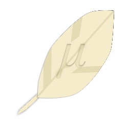

# Lightquery

Lightquery is a lighter, safer and more modern alternative to jQuery. It offers similar API but taking
some liberties to make it feel natural and modern.

For more information, consult the [user guide](https://voltra.github.io/lightquery). If you need any help,
please feel free to join my [discord server](https://discord.gg/JtWAjbw) dedicated to help developers use my libraries.

## Badges

     

 
